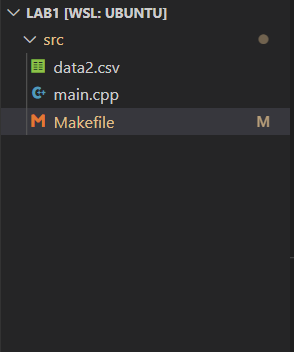
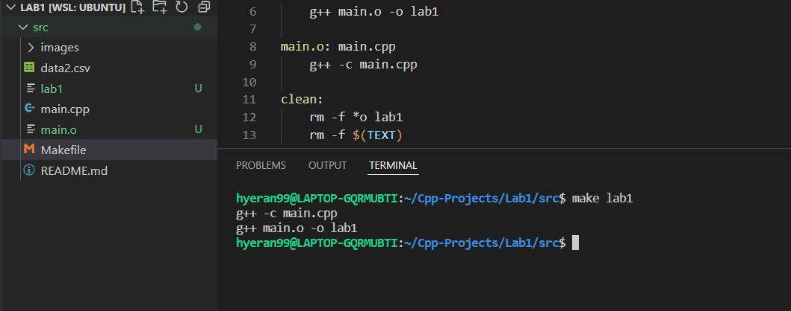

## How to run
1. Please enter "make lab1" on your terminal.
2. You will see lab1 file is created.
3. run lab1 on your terminal. ex) ./lab1
4. you will see the result.txt. 

## Sample Test

1. Initial state

2. make lab1 command entetred & result

3. run lab1 => ./lab1

4. Create result.txt file

