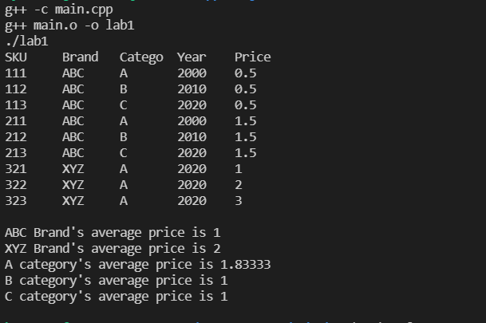

## How to run
1. Please enter "make lab1" on your terminal.
2. You will see lab1 file is created.
3. you will see the result.txt. 

## How it works

1. Initial state

2. "make lab1" command entetred & result

3. result.txt file is created

Please refere the Sample_result.txt for the final result

